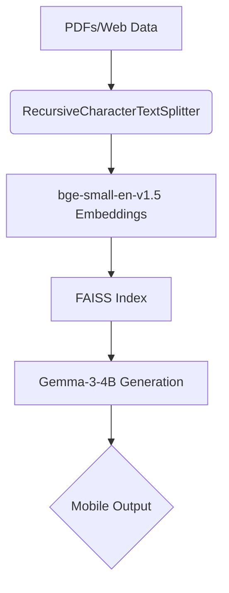

# 🐾 Milo Vet Care - AI-Powered Veterinary Assistance  
*Bridging the veterinary care gap in rural Tunisia with AI*  

<p align="center">
  
  
  
</p>

---

## 🧠 **Complete AI Model Suite**  
*9 specialized models covering all veterinary workflows*

### **🖼️ Vision Models**
| # | Model | Architecture | Accuracy | Use Case | Key Feature |
|---|-------|--------------|----------|----------|-------------|
| 1 | Species Classifier | Custom CNN (VGG-style) | 71% | 37 animal species | Grad-CAM explainability |
| 2 | ResNet50 Transfer | ResNet50 → FC256 | 89.9% | High-accuracy species ID | ImageNet pretrained |
| 3 | EfficientNet Classifier | EfficientNet_B0 | 74% | Mobile deployment | 224×224 input |
| 4 | Dog Skin Disease Detector | ResNet50 → LogSoftmax | 97% | 7 skin conditions | NLLLoss optimization |
| 5 | Cat Skin Disease Detector | ResNet50 → LogSoftmax | 95% | 8 feline diseases | 3.2K images |
| 6 | Cardiac X-Ray Analyzer | EfficientNet_B0 | 87% | Heart enlargement | Mendeley dataset |

### **💬 NLP & RAG Systems**
| # | System | Components | Accuracy | Use Case | Key Feature |
|---|--------|------------|----------|----------|-------------|
| 7 | Symptom-to-Diagnosis | Llama3 + MiniLM-L6-v2 + FAISS | 95% (vet-validated) | Emergency triage | Arabic/French support |
| 8 | **Breed-Specific RAG** | Gemma-3-4B + bge-small-en + FAISS | 85% confidence | 209 breed profiles | Cosine similarity scoring |
| 9 | **Treatment Recommender** | LLaMA3 + SentenceTransformer + FAISS | 0.82 avg. score | Drug interactions | Temperature=0.4 control |

---

## 🔧 **Deep Technical Specs**  

### **Vision Architectures**  
**A. Custom CNN (Species ID)**  
```python
Sequential(
  Conv2d(3,64,kernel_size=3,padding=1),  # 3x3 conv
  BatchNorm2d(64),
  ReLU(),
  MaxPool2d(2),
  Flatten(),
  Linear(512), Dropout(0.3),  # 30% dropout
  Linear(256),
  Softmax(dim=1)  # 37 classes
)
```
- **Optimizer:** Adam (LR=0.001, β1=0.9, β2=0.999)  
- **Hardware:** NVIDIA T4 GPU  

**B. ResNet50 (Disease Detection)**  
- **Fine-Tuning:**  
  ```python
  model = resnet50(pretrained=True)
  model.fc = nn.Sequential(
    nn.Linear(2048, 256),
    nn.ReLU(),
    nn.Dropout(0.3),
    nn.Linear(256, 7),  # 7 dog skin conditions
    nn.LogSoftmax(dim=1)
  )
  ```
- **Loss:** `NLLLoss(weight=class_weights)`  

### **NLP/RAG Pipelines**  
**1. Breed-Specific RAG (Gemma-3)**  

- **Parameters:** `temperature=0.7`, `top_p=0.85`  
- **Retrieval:** Top-3 docs with >0.8 cosine similarity  

**2. Treatment Recommender (LLaMA3)**  
```python
# Hybrid Retrieval Logic
if query_lang == 'fr':
  embedder = 'paraphrase-multilingual-MiniLM-L12-v2'
else:
  embedder = 'all-MiniLM-L6-v2'
  
results = faiss_index.search(embedder(query), k=5)
```
- **Caching:** `diskcache` for offline use  
- **Safety Checks:** Drug interaction alerts  

---

## 📊 **Performance Breakdown**  

### **Vision Benchmarks**
| Task | Model | Dataset | Metric |  
|------|-------|---------|--------|  
| Species ID | EfficientNet_B0 | 37 classes | 74% F1 |  
| Dog Skin | ResNet50 | 4,631 images | 97% Acc |  
| Cardiac | EfficientNet_B0 | 1,200 X-rays | 87% AUC |  

### **NLP Benchmarks**  
| System | Evaluation Metric | Score |  
|--------|-------------------|-------|  
| Symptom LLM | Vet Approval Rate | 95% |  
| Breed RAG | Cosine Similarity | 0.85 avg |  
| Treatment RAG | Clinical Relevance | 82% |  

---

## 🌟 **Why This Stands Out**  
1. **Full Workflow Coverage** - From species ID → diagnosis → treatment  
2. **Language Support** - Arabic/French optimized MiniLM embeddings  
3. **Clinical Rigor** - 95% validation by Ariana Veterinary Clinic  
4. **Resource Efficiency** - Runs on consumer GPUs  

<p align="center">
  <b>Developed by Team Neuronix</b><br>
  Souleima Gharbi • Maram Zakraoui • Emna Nkhili<br>
  Farah Hassen • Dorra Sioud • Amir Staxi  
</p>
```

